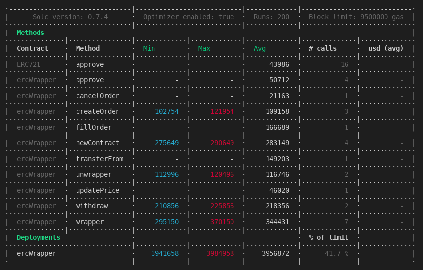

# ERC20 Basketz!

Wrap your ERC20 tokens in an ERC721 basket to transfer, swap, sell and more...

### Breakdown of contract functions

* Wrap and unwrap ERC20 Baskets, store any allowed ERC20 as one NFT.

* Ability to transfer ERC20 Baskets as NFT in one transaction.

* Use `hashed-timelock-contract` [[HTLC]](https://github.com/ConsenSys/hashed-timelock-contract-ethereum) to swap basket <> basket without 3rd party involvement.

* Auction your Basket for ETH.


### Deployment data

Contract is deployed on Matic Network. ABI data can be found in folder `contracts/abis`.

Testnet Matic network however has very limited amount of available [Chainlink price feeds](https://docs.chain.link/docs/matic-addresses), we are using ones defined in parentheses.

 * Wrapper deployed to: 0x1F6cF4780540D2E829964d0851146feaeA686827

 * Deployer address 0xc3f8e4bC305dcaAbd410b220E0734d4DeA7C0bc9

 * (DAI feed) tokA: 0x585477b415Ea1Bc88ABcA26c32755952CF24C631

 * (MATIC feed) tokB: 0xa30000D7B0B6b645FAAB3931C02320649f6Bee23

 * (USDC feed) tokC: 0x468C26d86c614cC3d8Eb8cFd89D5607f79D46289

 * (USDT feed) tokD: 0x9C35eb2Ddf340AD3ac051455ea26D44e1ed87DC9


Contracts can be also found on a Kovan Network.

SNX tokA means that contract is using SNX/ETH Chainlink price feed for a tokA mock contract. 

 * Wrapper deployed to: 0xac92c3eCEF51276f8F9154e94A55103D2341dE0A

 * Deployer address 0xc3f8e4bC305dcaAbd410b220E0734d4DeA7C0bc9

 * SNX tokA: 0x468C26d86c614cC3d8Eb8cFd89D5607f79D46289

 * ZRX tokB: 0x9C35eb2Ddf340AD3ac051455ea26D44e1ed87DC9

 * BAT tokC: 0x1F6cF4780540D2E829964d0851146feaeA686827

 * LINK tokD: 0x7aAE0b58df51A346182a11294e4Af42EEB3dA4c0

### Why this is cool?

* You can now batch transfer your ERC20 as ERC721.
* You can create a custom token-index composed of any ERC20s and **arbitrage on a demand** for a given composition of tokens.
* You can swap any basket of tokens for any other basket of tokens, thus change your exposure to the multiple tokens with one transaction.
* You can instantly sell a basket of N tokens in one transaction.
* Contract is supposed to be as permissionless as it can in the spirit of crypto finance.

### User perspective

1) Users creates a **wrap** by sending tokens *(min. 2, max. 10)* to `wrapper()` function.
2) Contract checks if tokens are whitelisted for wrapping. (Avoid low liquidity and unverified tokens!)
3) User **mints** NFT token corresponding to transferred tokens (tokens balance held in mapping `wrapped`).
4) User can **unwrap** NFT he owns back to his ERC20 tokens.
5) User can **transfer** NFT and ownership with claim on wrapped Tokens.
6) User can **swap** any basket with any other basket using a hashed timelock contract, thus no 3rd party involvement is needed.
7) User can check the balance of his basket using `wrappedBalance()`.
8) Contract uses Chainlink ethereum price feeds to calculate a value of the Basket.

### Motivation

We want to allow users to create personal indexes of tokens with sufficient underlying liquidity for easy trading and swapping between. The main benefit for the users is instant entry and exit into multiple tokens inside of a one transaction. This not only saves gas costs but also allows for formation of better trading strategies and arbitrage driven by a demand for more than one tokens (ie. Basket composed only of DEX-related tokens).

Given limited time and small team of two people, there are numerous improvements we wanted to introduce which may find its way into final (production) version of a protocol, e.g

* Use of TheGraph protocol for handling of events.

* Utilizing ERC721 metadata for additional features and financial calculations related to basket composition.

* Creation of a more liquid trading system, outside of currently proposed direct bidding.

* IPFS hosting for the whole protocol.

* Lending & Staking platform against user composed baskets.

* Fiat on-ramp to easily buy-in into multiple positions.


### Chainlink price feeds role

**Basket creation**

To make sure baskets are created only with verified tokens and to avoid fat finger mistakes we leverage Chainlink price feeds as a conditional check when creating basket. Only tokens tracked by Chainlink are allowed to exist in a basket.

**Basket pricing**

Because the contract allows swaps and selling of a basket we need to know the real value of the basket at current time. Users can set their premium over real price returned by Chainlink price feeds.

### Current gas costs, non-optimized.



### Tests output

Local tests will fail on order related operations because of inaccessible chainlink price feeds. However, contract was tested with mock-up price feeds before actual deployment.

````html
  ErcWrapper

    ✓ Standard wrapping
    ✓ Wrapping only from allowed list
    ✓ Unwrapping
    ✓ Transfer from U1 to U2
    ✓ User1 tries to unwrap already sent Basket
    ✓ User2 can unwrap after transfer
    ✓ Show balances
    ✓ Mint 2 new baskets
    ✓ Create Order
         no doubling orders!
         only the owner of the basket can create an order!
    ✓ Negative cases for createOrder, owner operations
         user1 cannot transfer basket currently for sale
    ✓ Negative cases for createOrder, transfers locked
         user2 doesnt send enough of the funds!
    ✓ Negative case for fillOrder, not enough funds
         user2 cannot buy what user1 didnt list!
    ✓ Negative case for fillOrder, basket not for sale
    ✓ Fill Order
    ✓ Negative case for fillOrder, cannot fill already filled
    ✓ Negative case for cancelOrder, only owner can cancel
    ✓ Negative case for cancelOrder, cannot cancel unlisted
    ✓ Cancel Order
    ✓ Update price

  HTLC Basket Swap

    ✓ Create Basket for U1 and U2 to exchange later
    ✓ U1 sets up swap with Basket1
    ✓ U2 sets up swap with Basket2
    ✓ Check HTLC balance before users swap
         approve fails because basket is already owned by htlc
    ✓ U1 tries to transfer basket locked in swap
         createOrder fails because basket is already owned by htlc
    ✓ U1 tries to create an order when basket locked in swap
    ✓ U1 withdraws
    ✓ U2 withdraws with secret
         users balances after swap match!
    ✓ Check balances
    ✓ Check Basket ownership after swap
````

## How to run

### Pre Requisites

Before running any command, make sure to install dependencies:

```sh
$ yarn install
```

### Compile

Compile the smart contracts with Hardhat:

```sh
$ yarn compile
```

### Run tests

```sh
$ yarn tests
```
